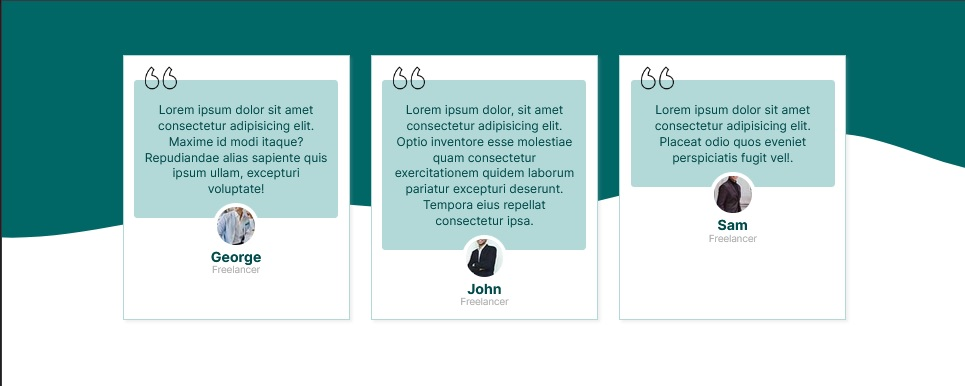
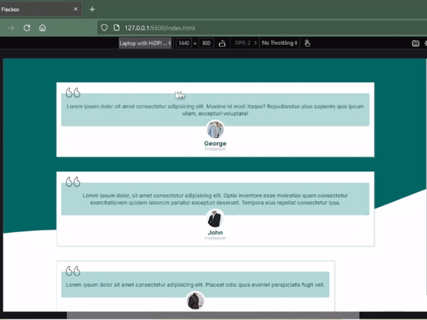
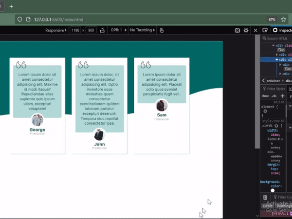
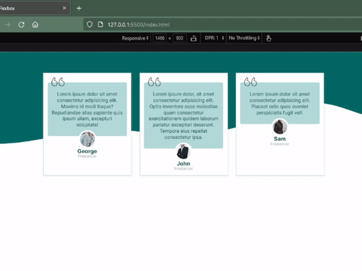

# Membuat Card Menggunakan Flexbox Responsive tanpa Media Queries

Membuat beberapa card tanpa memikirkan desain tampilan di tablet atau smartphone, mungkin kita bisa mencoba kecanggihan dari flexbox. 

Disini saya akan mencoba mempraktekkannya. Untuk menjadi perhatian, bahwa saya baru belajar, jadi jika pembaca menemukan hal yang lebih efektif dan lebih keren, jangan ragu untuk memberitahu saya ^_^.

Oke, misalnya saya punya 3 card testimoni seperti ini

[](asset/tampilan-card-desktop.jpg)

dan setiap card nya, saya mau lebar minimumnya 15em. tidak boleh kurang dari itu, karena nanti bakal tidak bagus tampilannya, karena terlalu langsing :v

## Lalu, apa yang saya lakukan?

Di sini saya mempunyai `<div>` dengan `class="container-card"` dimana didalamnya terdapat 3 card `<div>` dengan `class="cards"`.

yup, Anda benar, `.container-card` saya atur display nya `flex`, dan pengaturan lainnya :
```css
display: flex;
gap: 2rem;
flex-wrap: wrap;
```
Tapi, settingan itu belum selesai, kita lihat tampilannya akan seperti ini

[](asset/responsive-card-1.gif)

lalu masih ada baris code yang harus saya tambahkan agar tampilannya seperti yang saya inginkan. Masing-masing card saya tentukan lebar yang saya inginkan, ini akan saya tulis pada class `.cards` 
```css
width:15em;
```
Sip, lebar kartunya 15em. Agar semua card ditengah, saya tambahkan code `justify-content: center;` pada `.container-card`.

tapi responsive-nya ngga bagus nih tampilannya,

[](asset/responsive-card-2.gif)

kurang menarik kan?

Lalu, kunci canggihnya ada di properti `flex` yang kita taruh di `.cards`, saya atur seperti ini
```css
flex: 1 1 auto;
```
Properti flex diatas merupakan singkatan untuk : `flex-grow`, `flex-shrink`, `flex-basis`. Disini saya atur untuk `flex-grow` nilainya 1, artinya masing-masing card bisa grow/tumbuh memenuhi ruang kosong di dalam `.container-card`. Untuk nilai `flex-shrink` ini saya atur 1 atau 0 ternyata tidak ada effectnya, nilai defaultnya adalah 1, apakah mungkin karena saya sebelumnya sudah atur lebar masing-masing card yaitu 15em?

Untuk `flex-basis` saya atur nilainya auto, karena sebelumnya saya atur `width:15em` pada `.cards`.

Tapi ini hasilnya akan sama jika saya atur `flex-basis` nilainya langsung 15em. baris code nya akan jadi seperti ini ;
```css
flex: 1 1 15em;
```
width nya ngga usah di atur lagi, karena sudah digantikan oleh nilai `flex-basis`.

[](asset/responsive-card-3.gif).

Cek [Demo Cards Flexbox](https://fitrifityanto.github.io/practice-CSS-flex/cards-flex/cards-flex.html)


